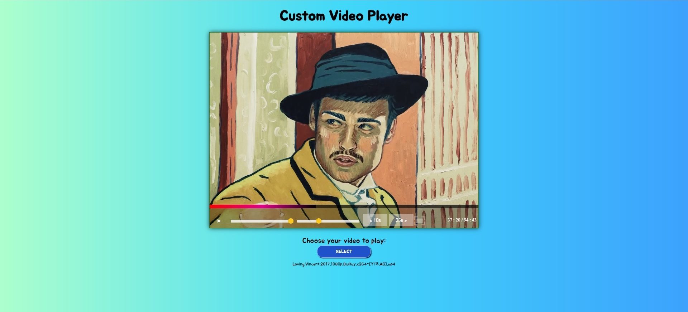

 
## Synopsis

HTML5 Video Player is a tool that renders videos (movies/ clips). 

This interface was created using:

* HTML
* CSS
* JavaScript

## Live Demo

To see the live demo, please [click here](https://patriciageo3.github.io/video-player/).

## Functionality

* Adjust sound
* Change playback rate
* Go back 10sec or forward 25sec
* Scrub through the video using your mouse
* Fullscreen
* View progress and full-time of video at any moment during playing
* Play custom videos from your computer

## Authors

Patricia Georgescu

## License & Copyrights
Default video shown: Alone by Heart (Alyona cover);

Alyona Yarushina - YouTube [here](https://www.youtube.com/channel/UC6w64Vo1yb1djDnvJfXHv-Q)

Video Shown in Preview: Loving Vincent (2017) - All rights reserved to the rightful owners & creators.

## Quick Preview

